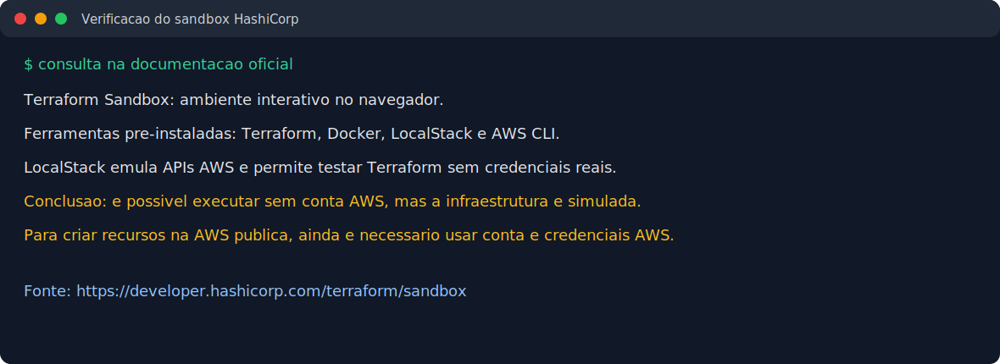
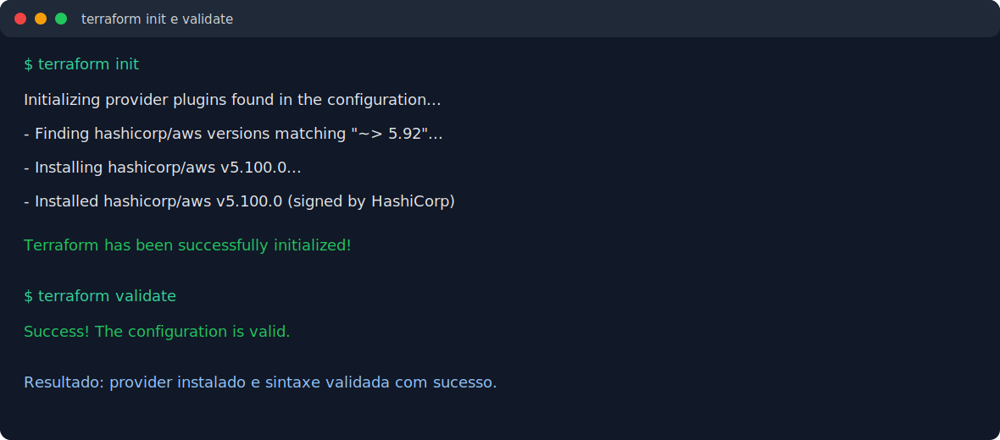
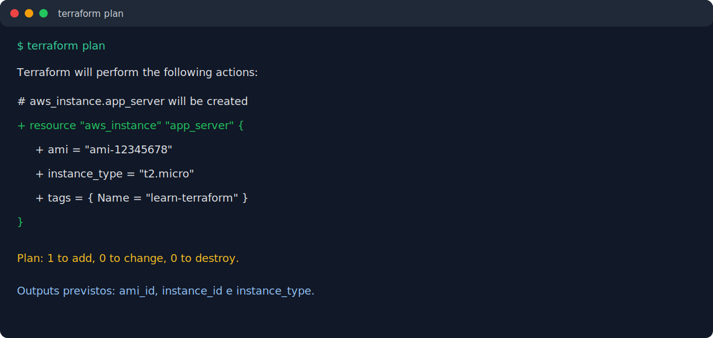
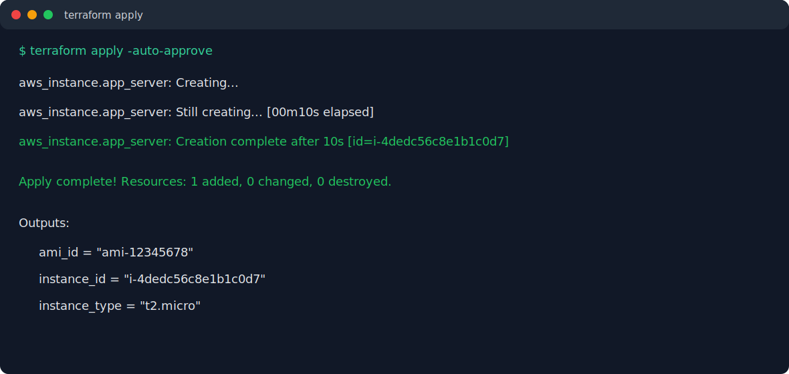
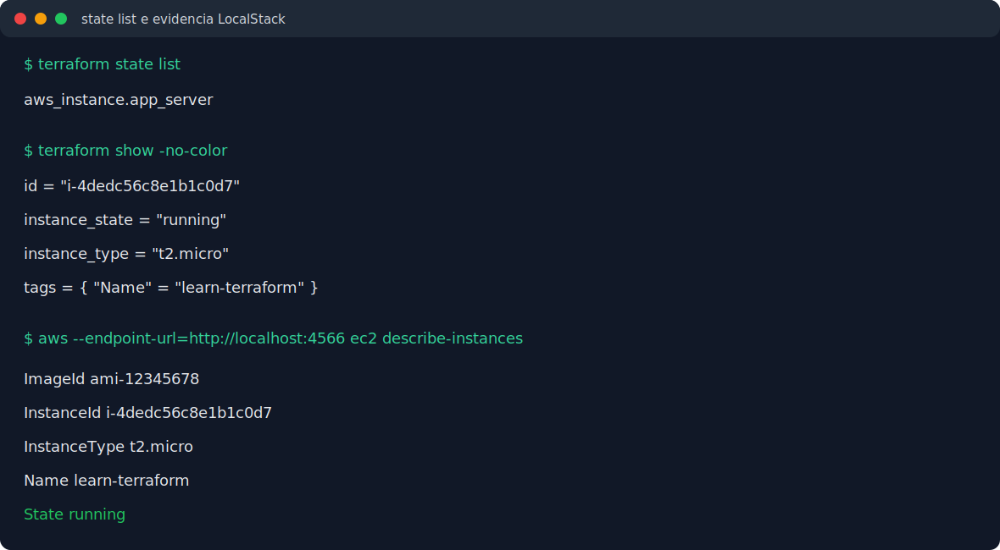
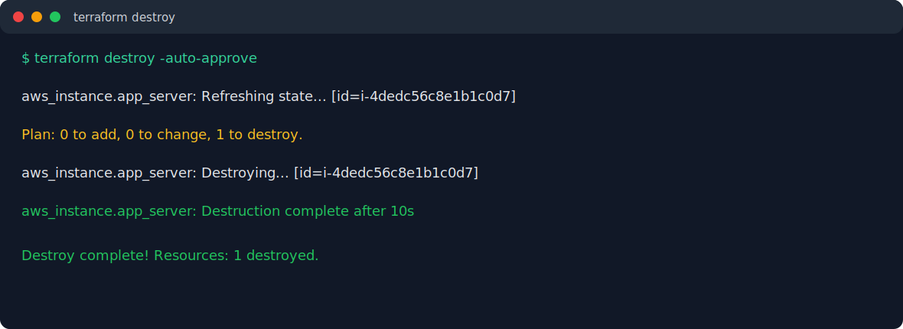

# Ponderada Terraform

Atividade baseada no tutorial oficial [Create infrastructure - Terraform AWS](https://developer.hashicorp.com/terraform/tutorials/aws-get-started/aws-create), com adaptação para execução no [Terraform Sandbox](https://developer.hashicorp.com/terraform/sandbox) da HashiCorp.

## Verificacao sobre uso do sandbox

E possivel executar a atividade sem uma conta AWS usando o Terraform Sandbox da HashiCorp. O sandbox ja vem com Terraform, Docker, LocalStack e AWS CLI instalados. Nesse modo, o Terraform conversa com o LocalStack, que emula APIs da AWS localmente.

Ponto importante: essa execucao nao cria recursos reais na AWS publica. Ela cria recursos simulados no ambiente sandbox. Para provisionar uma instancia EC2 real, ainda e necessario usar uma conta AWS e credenciais validas.



## Arquivos do projeto

- `terraform.tf`: define versao minima do Terraform e provider `hashicorp/aws`.
- `main.tf`: define provider AWS, AMI e instancia EC2.
- `variables.tf`: controla a execucao via LocalStack ou AWS real.
- `outputs.tf`: exibe AMI, ID e tipo da instancia criada.
- `localstack_override.tf`: redireciona o provider AWS para o LocalStack no sandbox.

## Passo a passo executado

### 1. Clonar o repositorio

```bash
git clone https://github.com/Rafaelfurtadovs/ponderada_terraform.git
cd ponderada_terraform
```

Proposito: baixar o codigo Terraform que descreve a infraestrutura como codigo.

### 2. Inicializar o Terraform

```bash
terraform init
```

Proposito: baixar o provider AWS e preparar o diretorio de trabalho.

### 3. Validar a configuracao

```bash
terraform validate
```

Proposito: conferir se os arquivos `.tf` estao corretos antes de criar recursos.



### 4. Gerar o plano de execucao

```bash
terraform plan
```

Proposito: visualizar o que o Terraform pretende criar antes de aplicar mudancas.

Resultado obtido: o plano indicou `1 to add, 0 to change, 0 to destroy`.



### 5. Aplicar a infraestrutura

```bash
terraform apply -auto-approve
```

Proposito: executar o plano e provisionar a instancia EC2 no ambiente configurado.

Resultado obtido: o Terraform criou `aws_instance.app_server` com sucesso.



### 6. Inspecionar o estado e os recursos

```bash
terraform state list
terraform show -no-color
```

Proposito: confirmar quais recursos estao sendo gerenciados pelo Terraform.

Tambem foi usada a AWS CLI apontando para o LocalStack:

```bash
AWS_ACCESS_KEY_ID=test AWS_SECRET_ACCESS_KEY=test AWS_DEFAULT_REGION=us-west-2 \
aws --endpoint-url=http://localhost:4566 ec2 describe-instances
```



### 7. Destruir a infraestrutura

```bash
terraform destroy -auto-approve
```

Proposito: remover os recursos criados e evitar manter infraestrutura ativa.



## Itens provisionados

| Item | Recurso Terraform | Descricao |
| --- | --- | --- |
| Instancia EC2 | `aws_instance.app_server` | Instancia tipo `t2.micro` com tag `Name=learn-terraform`. |
| AMI | `ami-12345678` no sandbox | AMI ficticia usada porque o LocalStack nao possui o catalogo publico de AMIs da AWS. |
| Volume raiz | Criado junto da instancia | Volume raiz exibido pelo `terraform show` como `root_block_device`. |
| Interface de rede | Criada junto da instancia | Interface simulada exibida no estado como `primary_network_interface_id`. |

Evidencia principal:

- `terraform state list` retornou `aws_instance.app_server`.
- `terraform show` exibiu `instance_state = "running"`.
- `aws ec2 describe-instances` exibiu a instancia `i-4dedc56c8e1b1c0d7` com estado `running`.

## Como executar em AWS real

Para criar uma instancia EC2 real na AWS publica:

1. Remova ou renomeie o arquivo `localstack_override.tf`.
2. Configure credenciais AWS validas.
3. Execute com a consulta real de AMI habilitada:

```bash
export AWS_ACCESS_KEY_ID="sua_access_key"
export AWS_SECRET_ACCESS_KEY="sua_secret_key"
export AWS_DEFAULT_REGION="us-west-2"
terraform apply -var='use_localstack=false'
```

Nesse modo, o Terraform usa o data source `aws_ami.ubuntu` para buscar a AMI Ubuntu mais recente na AWS.

## Observacao sobre a adaptacao

O tutorial oficial busca dinamicamente uma AMI Ubuntu na AWS. No LocalStack, essa consulta nao retorna o catalogo publico de AMIs. Por isso, a configuracao usa `ami-12345678` quando `use_localstack = true` e mantem a consulta dinamica quando `use_localstack = false`.
