# Ponderada Terraform
***Essa atividade conteve uso de IA generativa para auxilio na documentação***

Atividade baseada no tutorial oficial [Create infrastructure - Terraform AWS](https://developer.hashicorp.com/terraform/tutorials/aws-get-started/aws-create), com adaptação para execução no [Terraform Sandbox](https://developer.hashicorp.com/terraform/sandbox) da HashiCorp.

## Verificacao sobre uso do sandbox

E possivel executar a atividade sem uma conta AWS usando o Terraform Sandbox da HashiCorp. O sandbox ja vem com Terraform, Docker, LocalStack e AWS CLI instalados. Nesse modo, o Terraform conversa com o LocalStack, que emula APIs da AWS localmente.

## Arquivos do projeto

- `terraform.tf`: define versao minima do Terraform e provider `hashicorp/aws`.
- `main.tf`: define provider AWS, AMI e instancia EC2.
- `variables.tf`: controla a execucao via LocalStack ou AWS real.
- `outputs.tf`: exibe AMI, ID e tipo da instancia criada.
- `localstack_override.tf`: redireciona o provider AWS para o LocalStack no sandbox.

## Passo a passo executado

### 1. Clonar o repositorio

```bash
git clone https://github.com/Rafaelfurtadovs/ponderada_terraform.git
cd ponderada_terraform
```

Proposito: baixar o codigo Terraform que descreve a infraestrutura como codigo.

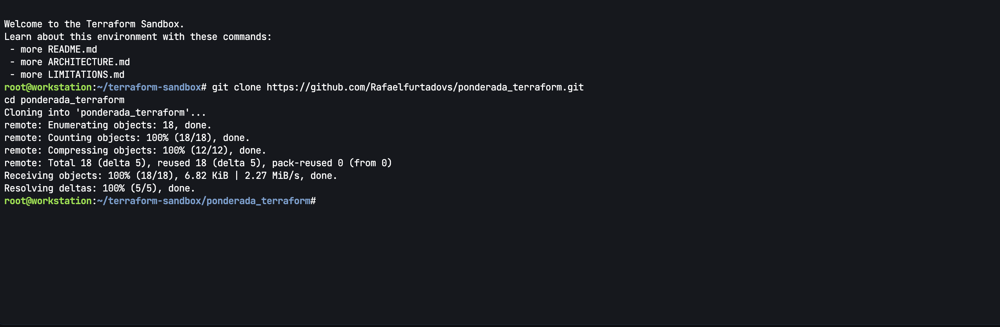

### 2. Inicializar o Terraform

```bash
terraform init
```

Proposito: baixar o provider AWS e preparar o diretorio de trabalho.

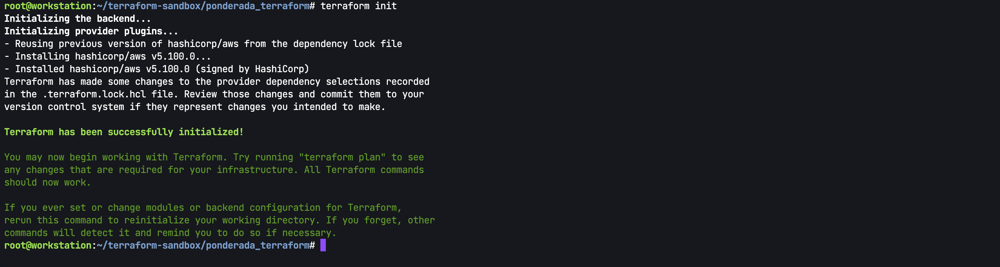

### 3. Validar a configuracao

```bash
terraform validate
```

Proposito: conferir se os arquivos `.tf` estao corretos antes de criar recursos.

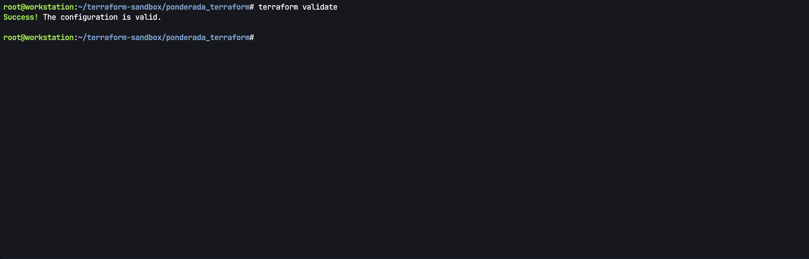

### 4. Gerar o plano de execucao

```bash
terraform plan
```

Proposito: visualizar o que o Terraform pretende criar antes de aplicar mudancas.

Resultado obtido: o plano indicou `1 to add, 0 to change, 0 to destroy`.

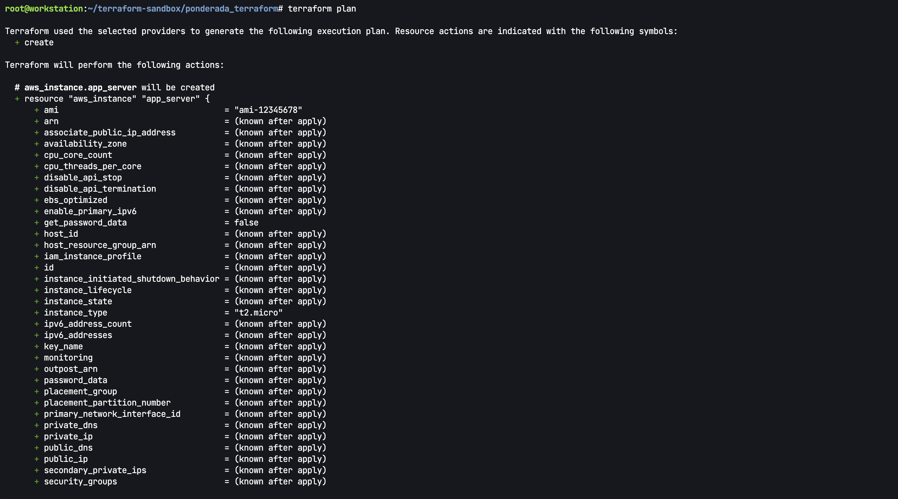

### 5. Aplicar a infraestrutura

```bash
terraform apply
```

Proposito: executar o plano e provisionar a instancia EC2 no ambiente configurado.

Ao ser solicitado, foi digitado `yes` para confirmar a criacao dos recursos.

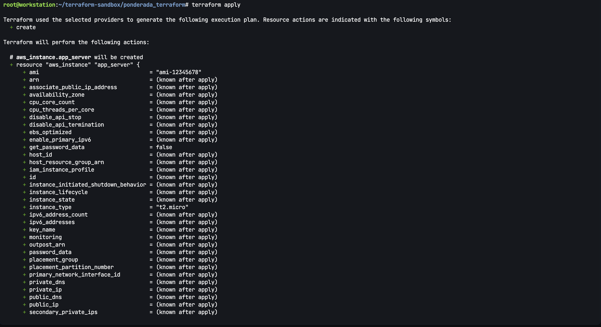

Resultado obtido: o Terraform criou `aws_instance.app_server` com sucesso. A instancia simulada recebeu o ID `i-d88616e6833976a8f`.

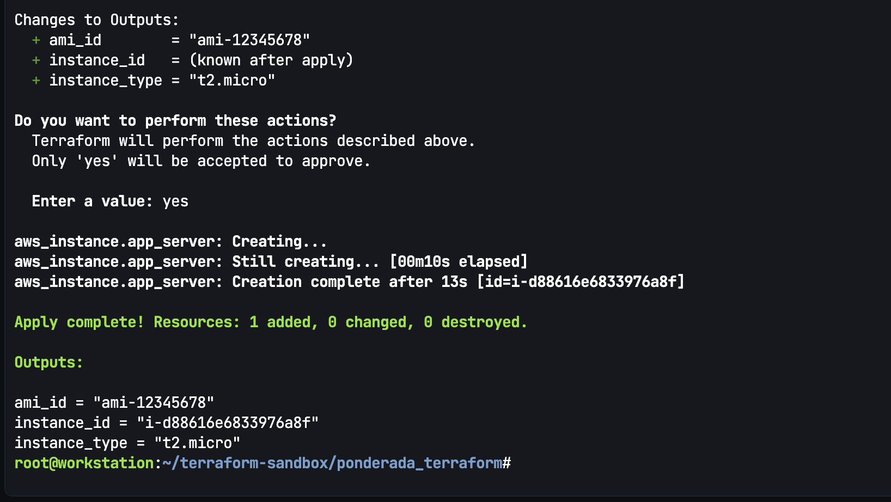

### 6. Inspecionar o estado e os recursos

```bash
terraform state list
terraform show -no-color
```

Proposito: confirmar quais recursos estao sendo gerenciados pelo Terraform.

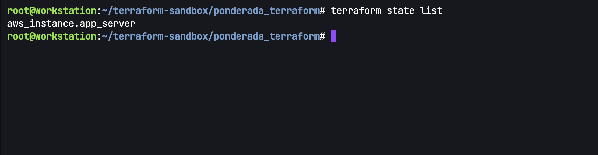

O comando `terraform show` exibiu os detalhes da instancia provisionada no sandbox, incluindo ID, AMI, tipo, estado, IPs simulados, subnet, interface de rede e tag.

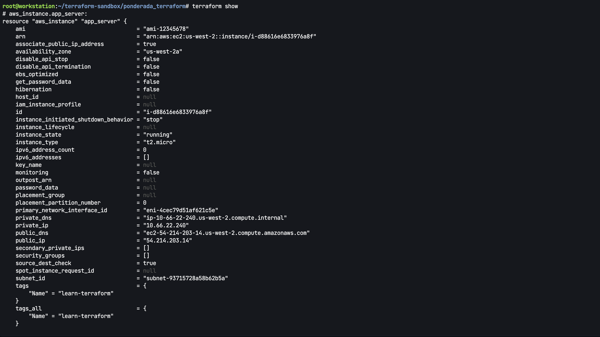

Tambem foi usada a AWS CLI dentro do sandbox:

```bash
aws ec2 describe-instances --output table
```

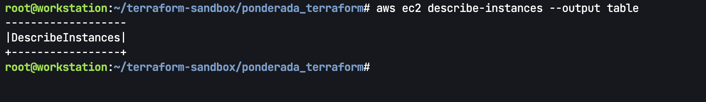

### 7. Destruir a infraestrutura

```bash
terraform destroy
```

Proposito: remover os recursos criados e evitar manter infraestrutura ativa.

Ao ser solicitado, foi digitado `yes` para confirmar a destruicao dos recursos.

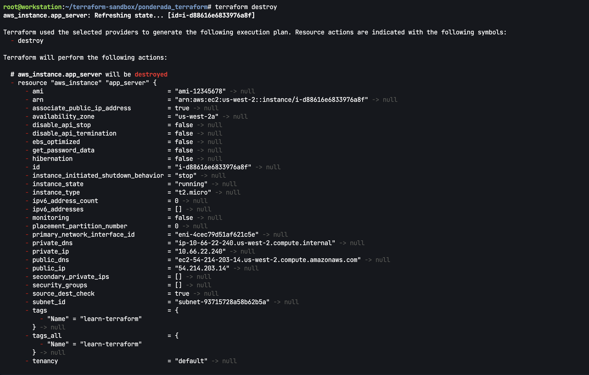

Resultado obtido: o Terraform removeu a instancia criada.

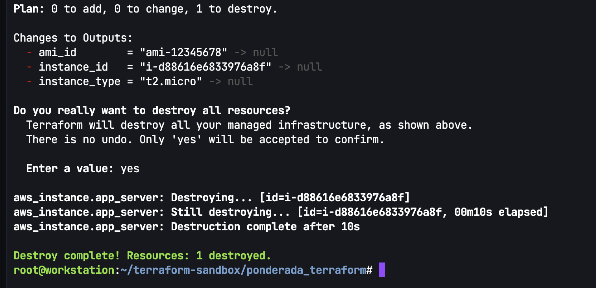

## Itens provisionados

| Item | Recurso Terraform | Descricao |
| --- | --- | --- |
| Instancia EC2 | `aws_instance.app_server` | Instancia tipo `t2.micro` com tag `Name=learn-terraform`. |
| AMI | `ami-12345678` no sandbox | AMI ficticia usada porque o LocalStack nao possui o catalogo publico de AMIs da AWS. |
| Volume raiz | Criado junto da instancia | Volume raiz exibido pelo `terraform show` como `root_block_device`. |
| Interface de rede | Criada junto da instancia | Interface simulada exibida no estado como `primary_network_interface_id`. |

Evidencia principal:

- `terraform state list` retornou `aws_instance.app_server`.
- `terraform show` exibiu `instance_state = "running"`.
- `terraform show` exibiu a instancia `i-d88616e6833976a8f` com tipo `t2.micro`, AMI `ami-12345678` e tag `Name=learn-terraform`.
